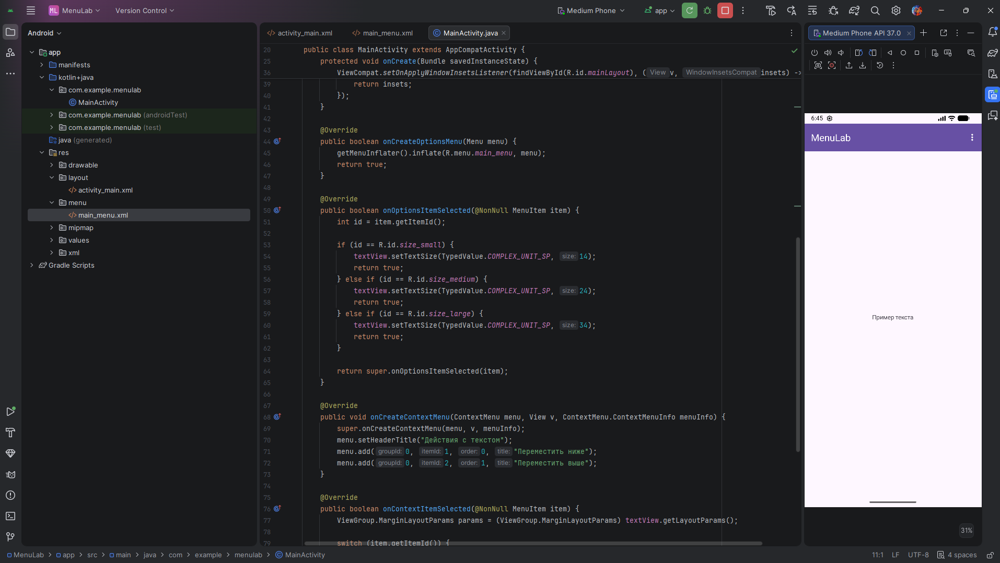
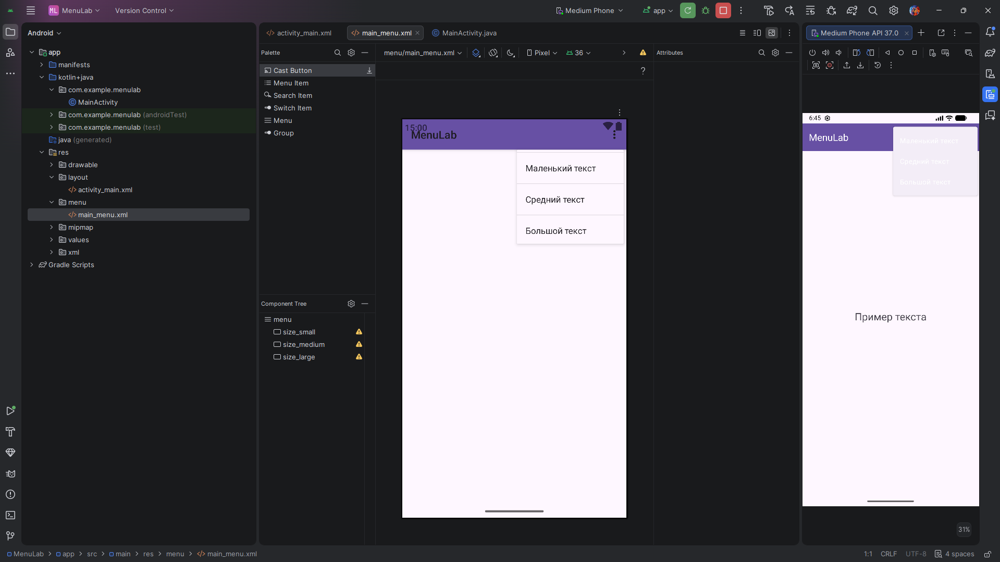
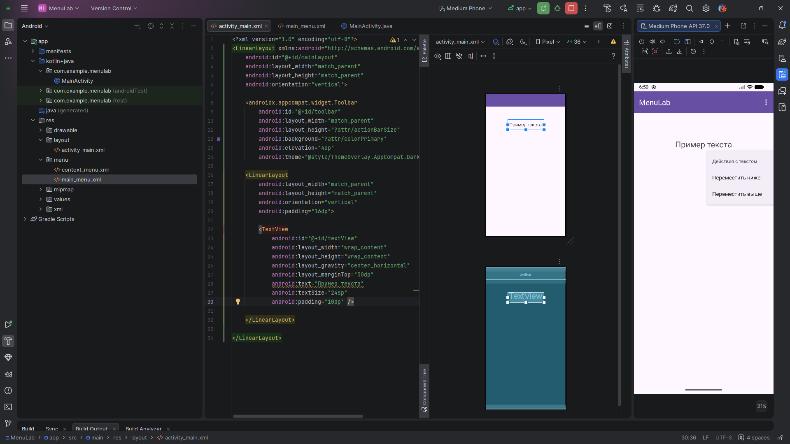

# Практическая работа №9: Работа с меню в Android

**Выполнил:**  
Саньков Андрей Александрович  
Группа: ИНС-б-о-24-1  
Направление: 09.03.02 «Информационные системы и технологии»

---

## Цель работы

Изучить способы создания и обработки событий от различных типов меню в Android: главного меню (OptionsMenu) и контекстного меню (ContextMenu). Научиться динамически изменять интерфейс приложения с помощью пунктов меню

---

## Ход работы

### Задание 1. Создание проекта и подготовка интерфейса

Создан проект `MenuLab`. В `activity_main.xml` размещены ImageView (для отображения картинок) и поясняющий TextView. В папку `res/drawable` добавлены три изображения: image1.png`, image2.png, image3.png.

**Скриншот интерфейса:**  



**Рисунок 1** — Интрефейс главной страницы

---

### Задание 2. Создание OptionsMenu (главное меню) – смена изображения

**Описание:**  
Создан файл `res/menu/main_menu.xml` с тремя пунктами для выбора изображения. В `MainActivity` переопределены `onCreateOptionsMenu()` и `onOptionsItemSelected()`. При выборе пункта меняется картинка в `ImageView`.

**Фрагмент кода main_menu.xml:**
```
<?xml version="1.0" encoding="utf-8"?>
<menu xmlns:android="http://schemas.android.com/apk/res/android">
    <item android:id="@+id/action_img1" android:title="Изображение 1" />
    <item android:id="@+id/action_img2" android:title="Изображение 2" />
    <item android:id="@+id/action_img3" android:title="Изображение 3" />
</menu>
```
Код из MainActivity.java:
```
// Загрузка главного меню из XML
@Override
public boolean onCreateOptionsMenu(Menu menu) {
    getMenuInflater().inflate(R.menu.main_menu, menu);
    return true;
}

// Обработка выбора пункта меню
@Override
public boolean onOptionsItemSelected(MenuItem item) {
    int id = item.getItemId();

    if (id == R.id.action_image1) {
        imageView.setImageResource(images[0]);
        return true;
    } else if (id == R.id.action_image2) {
        imageView.setImageResource(images[1]);
        return true;
    } else if (id == R.id.action_image3) {
        imageView.setImageResource(images[2]);
        return true;
    }
    return super.onOptionsItemSelected(item);
}
```


**Рисунок 2** — смена изображения

### Задание 3. Создание ContextMenu
Для ImageView зарегистрировано контекстное меню через registerForContextMenu(). Меню создано динамически в onCreateContextMenu() с двумя пунктами: «Повернуть по часовой стрелке» и «Повернуть против часовой стрелки». При выборе угол поворота ImageView увеличивается или уменьшается на 90 градусов.

Регистрация View в onCreate:
```
imageView = findViewById(R.id.imageView);
registerForContextMenu(imageView);
```
Создание контекстного меню (динамическое):
```
@Override
public void onCreateContextMenu(ContextMenu menu, View v, ContextMenu.ContextMenuInfo menuInfo) {
    super.onCreateContextMenu(menu, v, menuInfo);
    menu.setHeaderTitle("Поворот изображения");
    menu.add(0, 1, 0, "По часовой стрелке");
    menu.add(0, 2, 1, "Против часовой стрелки");
}
```
Обработка выбора:
```
@Override
public boolean onContextItemSelected(MenuItem item) {
    switch (item.getItemId()) {
        case 1:
            imageView.setRotation(imageView.getRotation() + 90);
            return true;
        case 2:
            imageView.setRotation(imageView.getRotation() - 90);
            return true;
    }
    return super.onContextItemSelected(item);
}
```


**Рисунок 3** — контекстное меню

### Задание 4. Объединение и тестирование
В рамках итоговой проверки приложение было запущено на эмуляторе.

Главное меню (OptionsMenu) вызывается нажатием на три точки в ActionBar и содержит три пункта: «Изображение 1», «Изображение 2», «Изображение 3». При выборе любого из них изображение в ImageView корректно меняется на соответствующее.

Контекстное меню вызывается долгим нажатием на то же ImageView. Заголовок «Поворот изображения» и пункты «По часовой стрелке» / «Против часовой стрелки» отображаются, при выборе изображение поворачивается на 90° в заданном направлении.

Оба меню работают без конфликтов, интерфейс не блокируется, переходов между экранами не требуется — всё реализовано в одной Activity.

Таким образом, все требования задания выполнены в полном объёме.
## Контрольные вопросы
### 1. Какие типы меню существуют в Android? Опишите их назначение.
OptionsMenu — главное меню приложения, вызывается нажатием кнопки в ActionBar (три точки). Используется для глобальных действий (настройки, смена режимов, выход).

ContextMenu — контекстное меню, появляется при долгом нажатии на элемент интерфейса. Предоставляет действия, специфичные для этого элемента.

PopupMenu — всплывающее меню, привязанное к конкретному View и появляющееся по обычному нажатию (например, на кнопку).

### 2. Как создать главное меню (OptionsMenu)? Какие методы необходимо переопределить в Activity?
Создать XML-файл в res/menu/ с описанием пунктов.

Переопределить два метода в Activity:

onCreateOptionsMenu(Menu menu) — вызвать getMenuInflater().inflate(R.menu.имя_файла, menu) и вернуть true.

onOptionsItemSelected(MenuItem item) — обработать выбор пункта по его id и вернуть true, если событие обработано.

### 3. Для чего используется атрибут app:showAsAction? Какие значения он может принимать?
Атрибут определяет, будет ли пункт меню отображаться непосредственно в ActionBar или скрыт в выпадающем меню (три точки).
Значения:

never — всегда в выпадающем меню.

ifRoom — показывать в ActionBar, если хватает места, иначе скрыть.

always — всегда показывать в ActionBar (не рекомендуется из-за возможной нехватки места).

### 4. Как зарегистрировать View для контекстного меню? В каком методе это обычно делается?
Вызвать метод registerForContextMenu(view). Обычно регистрация выполняется в методе onCreate Activity после setContentView и findViewById.
```
imageView = findViewById(R.id.imageView);
registerForContextMenu(imageView);
```
### 5. В чём разница между методами onCreateContextMenu и onContextItemSelected?
onCreateContextMenu — вызывается при формировании контекстного меню перед его показом. Здесь создаются пункты меню (заголовок, добавление элементов).

onContextItemSelected — вызывается, когда пользователь выбрал один из пунктов контекстного меню. Здесь выполняется нужное действие.

### 6. Как создать контекстное меню динамически (программно), без использования XML-ресурса?
В методе onCreateContextMenu использовать метод menu.add(groupId, itemId, order, title). Например:
```
menu.add(0, 1, 0, "По часовой стрелке");
menu.add(0, 2, 1, "Против часовой стрелки");
```
Где 1 и 2 — идентификаторы, используемые позже в onContextItemSelected.

### 7. Что возвращают методы onOptionsItemSelected и onContextItemSelected? Что означает возврат true?
Оба метода возвращают boolean.

true означает, что событие полностью обработано и не должно передаваться дальше по цепочке обработки.

false (или вызов super) передаёт событие суперклассу, что может привести к дополнительным действиям или игнорированию.

### 8. Как определить, для какого именно элемента было вызвано контекстное меню, если зарегистрировано несколько View?
В методе onCreateContextMenu передаётся параметр View v — это тот самый View, на котором было выполнено долгое нажатие. Можно сравнить его с ранее сохранёнными объектами или использовать v.getId() для проверки, например:
```
if (v.getId() == R.id.imageView) {
    // меню для ImageView
} else if (v.getId() == R.id.textView) {
    // другое меню
}
```

